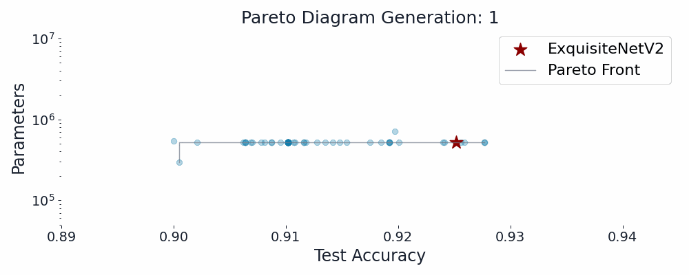

## Guided Evolution:

  

 

______

### Introduction:

______

In the ever-evolving domain of machine learning, the convergence of human cognitive skills and automated algorithms is entering a pivotal junction. This paper introduces “Guided Evolution” (GE), a novel framework that combines the human-like expertise of Large Language Models (LLMs) with the robust capabilities of Neural Architecture Search (NAS) through genetic algorithms. This innovative fusion advances automated machine learning, elevating traditional NAS by integrating a more insightful, intelligently guided evolutionary process.

Central to this framework is our  “Evolution of Thought” (EoT) technique, which extends and refines concepts like Zero-Shot Chain-of-Thought, Automated Chain-of-Thought, and Tree-of-Thought \cite{kojima2022large, zhang2022automatic, yao2023tree}. These methodologies aim to improve the reasoning capabilities of LLMs. EoT takes a unique step forward by enabling LLMs to receive result-driven feedback, empowering them to make informed improvements based on the performance of their prior code augmentations, a significant advancement in intelligent automated machine learning.

EoT catalyzes LLMs to introspect and fine-tune suggestions based on past iterations, creating a self-enhancing feedback loop that fine-tunes architectural evolution. At the same, GE maintains essential genetic diversity for evolutionary algorithms while injecting human-like expertise and creativity into the evolutionary framework. Building from the insights of Ma et al. \cite{ma2023conceptual}, our Guided Evolutionary framework is further enhanced by a Character Role Play (CRP) technique, to markedly increase the feasibility, usefulness and creativity of ideas engendered by the LLM. 

The effectiveness of the Guided Evolution (GE) framework is showcased in the evolution of the ExquisiteNetV2 model. This evolution, initiated with a State-Of-The-Art (SOTA) seed model, not only demonstrates the capacity of LLMs to build upon and enhance SOTA models in collaboration with human expertise but also underscores their autonomous model design. This case study illustrates the framework's self-sufficient ability to generate improved model variants, emphasizing the burgeoning impact of LLMs in redefining traditional model design pipelines, a step towards models that independently evolve and refine their architectures. 

### Setup

This code utilizes [ExquisiteNetV2](https://github.com/shyhyawJou/ExquisiteNetV2) which is copied into the sota directory.

Dependencies are managed through `pyproject.toml`. This package can be installed with `pip install .` or interacted with through tools such as `uv` 

Then follow the instructions to prepare the CIFAR10 dataset in the [ExquisiteNetV2 README](./sota/ExquisiteNetV2/README.md)

This code has been tested on Python 3.12

### Setup -- Pointnet++

This code utilizes [pointnet_pointnet2_pytroch](https://github.com/yanx27/Pointnet_Pointnet2_pytorch) which is copied into the sota directory.

First install dependencies using `conda env create -f environment.yml`

Then follow the instructions to prepare the modelnet40 dataset in the [pointnet_pointnet2_pytroch](https://github.com/yanx27/Pointnet_Pointnet2_pytorch/README.md)
(if this is being run on PACE-ICE, then there is no need to acquire the dataset as the path already points to modelnet40)

Necessary changes needed to run the LLMGE on Pointnet++ is to change all paths in to your own paths in your directory (all paths point to my absolute directory). 
  - run_improved.py line 311 the python runline
  - src/cfg/constants.py
  - If you are utilizing a local LLM in constants.py make sure the path to that model is updated, if you have the huggingface paid version then comment out all of new_server.py and LLM_MODEL_PATH in constants.py
  - If there are more changes that need to be made elsewhere I apologize

If all changes above have been made run bash run.sh and you should be able to use the framework.

This code has been tested on Python 3.9

### Autonomous Model Evolution:
_____

  

### Paper
_____

[LLM Guided Evolution - The Automation of Models Advancing Models](./assets/paper/LLM_Guided_Evolution___The_Automation_of_Models_Advancing_Models.pdf)
