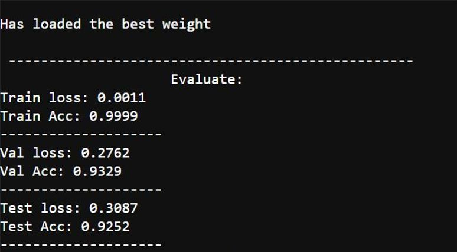

# Update
- __[2021/09/24]__
  * Change the initial learning rate to higher value (0.1)
  * Change the step-down factor of lr rate to higher value (0.7)  
  * According to the experimental result, it is better for ExquisiteNetV2.

# Result
| Data     |    Model       | Params | Top-1 Test Acc (%) |
| :-----:  | :------------: | :----: | :------------: |
| Cifar-10 | ExquisiteNetV2 |  0.51M | 92.52          |
| Mnist    | ExquisiteNetV2 |  0.51M | 99.71          |

# Requirements
- [Pytorch >= 1.8.0](https://pytorch.org/)
- Tensorboard
  ```
  pip install tensorboard
  ```

# Train Cifar-10
The best weight has been in the directory `weight/exp`.

If you want to reproduce the result, you can follow the precedure below.
- __Download the cifar-10 from [official website](https://www.cs.toronto.edu/~kriz/cifar.html)__
  1. Download python version and unzip it.
  2. Put `split.py` into the directory `cifar-10-python`  
     then type:
     ```
     python split.py
     ```  
     Now you get the cifar10 raw image in the directory `cifar10`
     
- __Train from scratch__
  ```
  python train.py -data cifar10 -end_lr 0.001 -seed 21 -val_r 0.2 -amp
  ```

- __Result__  
  After training stop, You will get this result.
  
  
# Evaluation
```
python eval.py -data cifar10/test -weight md.pt
```


If my code has defect or there is better algorithm, welcome to contact me :)
